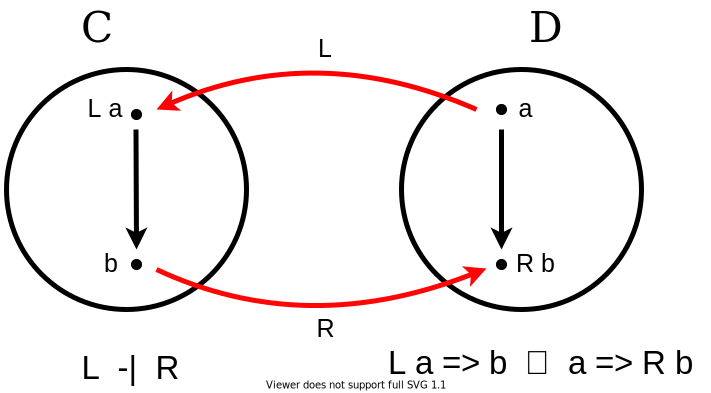
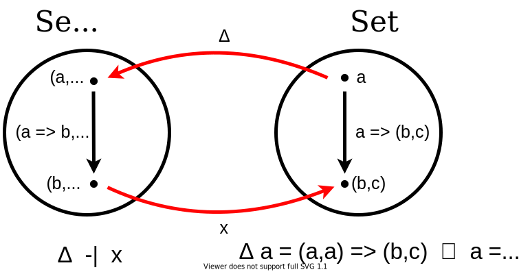
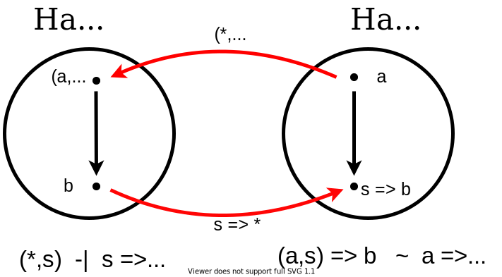
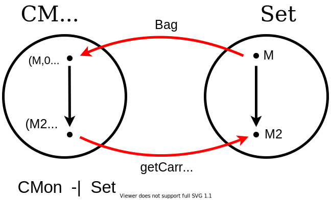

# Relational algebra by way of adjunctions

## Plan
1. Problem `monads` gives for comprehension can express from relational algebra projection and selection but not equi-joins
2. fundamental concepts of `category theory`
3. simplified `relational algebra` - collections are `finite bags`
4. simplified relational algebra - collections are `finite maps`
5. simplified relational algebra - collections are `indexed tables`
6. proove equi-join is linear time on indexed tables
7. `graded monads` to model indexed tables with finite domain - final model of databases
8. optimizaions for query optimizations arise from theory

## 1 Monads for relational algebra is not enough

* `bulk data types` (sets, bags, lists, trees ?) are `monads`
* so support database queries based on `for comprehensions`:
  - 1960 [SETL](https://en.wikipedia.org/wiki/SETL) Algol 60, query language based on sets, like for comprehension  
  - 1970 NPL  
  - 2000 [Kleisli](https://dl.acm.org/doi/10.1017/S0956796899003585), query language CPL, in SML, for bioinformatics  
  - 2006 [LINQ](https://docs.microsoft.com/en-us/dotnet/csharp/programming-guide/concepts/linq/), query language for C#
  - 2006 Links,
  - 2001 [XQuery](https://www.w3schools.com/xml/xquery_intro.asp) query language for XML
  - 2015 MapReduce
  - for comprehensions in FP languages: Scala, Haskell, Clojure/Scheme
  - TODO does Json Pointer [RFC6901](https://tools.ietf.org/html/rfc6901) support for comprehensions? 
```haskell
[ (cust.name, inv.amount) |
  cust <- customers,
  inv <- invoices,
  cust.cust_id = inv.cust_id,
  inv.due < now() 
]
```

```Scala
for {
  c <- customers
  i <- invoices if c.id == i.custId && i.dueDate.isBefore(now)
} yield (c,i)
```
* DSL for database language (relational algebra)
* monadic structure directly support: `selections` and `projections` from relational algebra

|      | relational algebra | SQL |
|------|--------------------|-----|
| π    | projection         | SELECT cust.name FROM customers cust              |
| σ    | selection          | WHERE inv.due < now()                             |
| ⋈    | equi join          | INNER JOIN invoices inv ON cust.id = inv.cust_id  |

* but only indirectly support: `join` as `cartesian product` + `selection` from relational algebra

SQL:
```sql
SELECT c.name, i.amount
FROM customers c
INNER JOIN invoices i
  ON c.id = i.cust_id
WHERE i.due < now
```

Haskell:
```Haskell
fmap( λ(c,i) -> (c.name, i.amount) ) (
  filter( λ(c,i) -> i.due < now) (
    filter( λ(c,i) -> c.id == i.cust_id) (
      cp (customers, invoices)
    )
  ) 
)
```

TODO what about left join? cross join? group by? order by?

* This leads to inefficient query plan: needs full cartesian product and discard many tuples that do not match filter conditions.
There is a way to express efficient query:
```Haskell
fmap(fmap name x fmap amount) (cod (
  fmap (id x filter (λi -> i.due < now)) (
    merge (customers `indexBy` cid, invoices `indexBy` cust)
  )  
))
```
where `k` type of `keys`, `v` type of `values`,
`k-indexed tables of v-values`:
```Haskell
indexBy :: key k => Bag v -> (v -> k) -> (k -> Bag v)
merge   :: Key k => (k -> v, k -> v1) -> (k -> (v, v1))
cod     :: Key k => (k -> Bag v) -> Bag v
```

Scala
```Scala
trait Key[K]
trait Bag[V]
abstract class RelationalAlgebra[V] {
  def indexBy[K: Key]:   Bag[V] => (V => K) => (K => Bag[V])
  def merge[K: Key, V1]: (K => V, K => V1) => (K => (V,V1))
  def cod[K: Key]:       K => Bag[V] => Bag[V]
}
```
It has linear time result: `Bag (Bag Name x Bag Amount)` and quadratic if we flatten to `Bag (Name x Amount)`.  
(TODO does linear vs quadratic applied to Slick?)  
But we loose for comprehension syntax.  
* Solution in `category theory` namely `adjunction`

* `monads` of bulk types arise `from adjunctions`
* adjunctions explain grouping and merging (needed for linear time equi-joins)
* universal property of adjunction express equivalences that justify query transformations (including query optimizations)
* 1997 Libkin & Wong universal properties of collections into programming syntax TODO explore in Scala
* monads, adjunctions vs relational algebra

|             | give rise to |
|-------------|--------------|
| monads      | point-wise notation of for comprehension |
| adjunctions | point free combinators |

* how adjucntions model notation based on for comprehensions (to query collections)
* get equational properties of collectins processing from adjunctions identities
* add grouping and merging of indexed collections (identify adjunctions)

## 2 Basic concepts of category theory

* `category theory` is `mathematics of mathematics`

### 2.1 Categories

A category C consists of:
* a collection of `objects`
* a collection of `arrows` (`morphisms`)
* each arrow f: A -> B goes form `source object` A to `target object` B
* fore each object A there is an `identity arrow`  
`id A`: A -> A
* adjacent arrows f: A -> B and g: B -> C `compose` to form g:* f: A -> C
* composition is `associative`
* appropriate identity arrows are `neutral elements`

```scala
trait Semicategory[X, Morphism[_ <: X, _ <: X]] {
  def compose[A <: X, B <: X, C <: X](f: Morphism[B, C])(g: Morphism[A, B]): Morphism[A, C]
}

trait SemicategoryLaws[X, M[_ <: X, _ <: X]] extends Semicategory[X, M] {

  def compositivityLaw[A <: X, B <: X, C <: X, D <: X](g: M[B, C], f: M[A, B], h: M[C, D]): Boolean = {
      val gf: M[A, C] = compose(g)(f)
      val v2: M[A, D] = compose(h)(gf)
    
      val hg: M[B, D] = compose(h)(g)
      val w2: M[A, D] = compose(hg)(f)
    
      v2 == w2
  }
}

trait Category[X, Morphism[_  <: X, _  <: X]] extends Semicategory[X, Morphism] {
  def id[Obj <: X]: Morphism[Obj, Obj]
}

trait CategoryLaws[X, M[_ <: X, _ <: X]] extends Category[X, M] {
  def leftIdentityLaw[A <: X, B <: X](fa: M[A, B]): Boolean = {
    compose(id[B])(fa) == fa
  }

  def rightIdentityLaw[A <: X, B <: X](fa: M[A, B]): Boolean = {
    compose(fa)(id[A]) == fa
  }
}
```

A `hom-set` C(A,B) consists of the arrows in C from A to B.

An `initial object` O has unique arrow from it to any other object.

`Dually` a `final object` (`terminal object`) 1 has a unique arrow to it from any other.

Example 1: `Hask`/`Skal`
* objects: types
* arrows: functions / pure, one argument functions
* initial object: Void/Nothing
* terminal object: Unit

Example 2: `Set`
* objects: sets
* arrows: total functions
* initial object: empty set
* terminal object: one element set (`singleton`)

Classic encoding (Scala, Haskell, Idris, Agda): [lemastero/scala_typeclassopedia Category](https://github.com/lemastero/scala_typeclassopedia/blob/master/Profunctors.MD#category)

[encoding including terminal/initial objects, products etc](https://github.com/lemastero/Triglav/blob/master/src/main/scala/Triglav/cat1/Cat1Instances.scala)

```scala
val scalaProperTypesAndPureFunction1: Category[Any, Function1] =
  new Category[Any, Function1] {
    def id[A]: A => A = identity[A]
    def compose[A, B, C](f: B => C)(g: A => B): A => C = g andThen f
  }
```

If we add structure then arrows are structure preserving mappings.

Example 3: Ordered sets
* objects: ordered sets
* arrows: monotinic functions

Example 4: `Mon`
* objects: monoids
* arrows: monoids homomorphisms

```scala
trait Semigroup[M] {
  def combine(lhs: M, rhs: M): M
}

// TODO laws

trait Monoid[M] extends Semigroup[M] {
  def empty: M
}

// TODO laws
```

```scala
def Mon[M, MM : Monoid]: Category[Monoid[M], Function1] = new Category[Monoid[M], Function1] {
  def id[Obj <: Monoid[M]]: Obj => Obj =
    identity[Obj]

  def compose[A <: Monoid[M], B <: Monoid[M], C <: Monoid[M]](f: B => C)(g: A => B): A => C =
    f compose g
}
```

Example 5: `CMon`
* objects: `commutative monoids`: `(M1,e,+)` where M is a set, operation `+: M x M -> M` is `associative` and `commutative` with `neutral element` `e: M`
* arrows: `monoids homomorphisms`: functions between underlying sets `M1 -> M2`, that satisfy:  
 `h e1 = e2`  
 `h (x + y) = (h x) * (h y)`  

Underlying set `M` is called `carrier`.

```scala
trait CommutativeMonoid[M] extends Monoid[M]

// TODO laws
```

```scala
def CMon[M, MM : CommutativeMonoid]: Category[CommutativeMonoid[M], Function1] = new Category[CommutativeMonoid[M], Function1] {

  def id[Obj <: CommutativeMonoid[M]]: Obj => Obj =
    identity[Obj]

  def compose[A <: CommutativeMonoid[M], B <: CommutativeMonoid[M], C <: CommutativeMonoid[M]](f: B => C)(g: A => B): A => C =
    f compose g
}
```

Examples from lemastero/Triglav:
* [category of type constructors wih 1 hole](https://github.com/lemastero/Triglav/blob/master/src/main/scala/Triglav/cat2/FinitelyComplete2Category.scala), [instance](https://github.com/lemastero/Triglav/blob/master/src/main/scala/Triglav/cat2/TwoCategoryFInstances.scala)
* [category of type constructors with 2 holes](https://github.com/lemastero/Triglav/blob/master/src/main/scala/Triglav/catpro/ProCategory.scala)
 
### 2.2 Functors

Category have structure. Functors are teh structure-preserving mappings between categories.

A functor `F: C -> D` from category `C` to category `D`
maps the objects and arrows of C to objects and arrows of D,
such that it preserve:
* sources and targets: `F f : (F A) -> (F B)` when `f : A -> B`
* identities: `F (id A) = id (F A)`
* composition `F (g . f) = (F g) . (F f)`
.

TODO Using dependent types: we can say F(f) is dependent type and depends on function and source object?

Classic encoding (Scala, Haskell, Haskell data-category, Idris, Agda): [lemastero/scala_typeclassopedia Functor](https://github.com/lemastero/scala_typeclassopedia#functor-covariant-functor)

Functors form a category `Cat` because:
* There is `identity functor`.
* functors `compose`.

Example `U: CMon -> Set`
maps a commutative monoid to it's carrier set.

When C and D coincide we call F an `endofunctor`.  
In Set endofunctors can be seen as parametric type constructors, such as Bag (List, Vector, Tree, ...),
which maps an object A (a set of elements - error should be element !) to the object Bag A (the set of finite bags of those elements)
, and arrow `f: A -> B` o the arrow `Bag f : Bag A -> Bag B` that applies f to each element of a bag.

In Scala:

|           | is mapped to   | example           |
|-----------|----------------|-------------------|
| `A`       | `List[A]`      | List(42)          |
| `A => B`  | `F[A] => F[B]` | v.map(_.toString) |

It is instructive to verify that it preserve the structure.  
TODO in Scala Set is in alleycats, one can change comparison or collapse elements - in a sense changing the structure!
But some people (Runar, B. Milewski claims that Set is a proper Monad.)   

### 2.3 Natural transformations

Examples Scala:
* List => Option: headOption
* Either => Option: toOption

Classic encoding (Scala, Haskell, Haskell data-category, Idris, Agda): [lemastero/scala_typeclassopedia Natural Transformation](https://github.com/lemastero/scala_typeclassopedia/blob/master/HigherKinded.MD#natural-transformation-functionk)

### 2.4 Adjunctions
* original concept in Category Theory
* comes from Galois connection from lattice theory

Functors L: D -> C and R C -> D form an `adjunction` `L -|` if the arrows L A -> B in C are in natural 1-to-1 correspondence with the arrows A -> R B

C(L A, B) ~ D(A, R B)



This is natural in the sense that there are natural transformations ...

### Adjunction in FP

[Haskell](https://hackage.haskell.org/package/adjunctions-4.4/docs/Data-Functor-Adjunction.html)

```Haskell
class (Functor f, Representable u) => Adjunction f u | f -> u, u -> f where
  unit         :: a -> u (f a)
  counit       :: f (u a) -> a
  leftAdjunct  :: (f a -> b) -> a -> u b
  rightAdjunct :: (a -> u b) -> f a -> b

  unit           = leftAdjunct id
  counit         = rightAdjunct id
  leftAdjunct f  = fmap f . unit
  rightAdjunct f = counit . fmap f
```

[Scalaz](https://github.com/scalaz/scalaz/blob/series/7.3.x/core/src/main/scala/scalaz/Adjunction.scala)

```scala
trait Adjunction[F[_], G[_]] {
  def left[X, Y](f: F[X] => Y): X => G[Y]
  def right[X, Y](f: X => G[Y]): F[X] => Y

  def unit[A]: A => G[F[A]] = left(identity)
  def counit[B]: F[G[B]] => B = right(identity)
}

trait AdjunctionLaws[F[_], G[_]] extends Adjunction[F, G] {
  val FF: Functor[F]
  val FG: Functor[G]

  def triangleIdentityF[A](fa: F[A]): Boolean = {
    val rhs1: F[G[F[A]]] = FF.map(fa)(unit)
    val rhs2: F[A] = counit(rhs1)
    fa == rhs2
  }

  def triangleIdentityG[A](fa: G[A]): Boolean = {
    val rhs1: G[F[G[A]]] = unit(fa)
    val rhs2: G[A] = FG.map(rhs1)(counit)
    fa == rhs2
  }
}
```

### Example of adjunction Δ -| x

Category Set^2 (`product category`)  
objects: paris `(A,B)` of Set-objects `A` and `B`  
arrows: pairs `(f,g) : (A.B) -> (C,D)` of Set-arrows `f: A -> C` and `g : B -> D`  

Diagonal functor `Δ: Set -> Set^2` take object `A` and arrow `f` in Set to `(A,A)` and `(f,f)` in `Set^2`  
Adjunction `Δ -| x` between  Set^2 and Set captures the equivalence between arrows `ΔA -> (B,C)` ins `Set^2`  
that is pairs of functions with a common domain and  
arrows `A -> B x C` in Set



### Example adjunction product and tuple

```scala
def tupleFunctionFromAdjunction[R]: Adjunction2[Tuple2[*, R], Function1[R, *]] =
  new Adjunction2[(*, R), R => *] {
    def left[A, B](f: ((A, R)) => B): A => R => B =
      Function.untupled(f).curried

    def right[A, B](f: A => R => B): ((A, R)) => B =
      Function.uncurried(f).tupled
  }
```



### Important adjunctions example Bags

* Bags are free commutative monoids
* CMon and Set are categories
* adjunction: `Free -| U` (forgetful functor) between CMon and Set, that embed set `A`: `Free A = (Bag A, 0, +)`  
and the retraction (forgetful functor) `U: (M, e, +) -> M` of commutative monoid into its carrier



### 2.5 Monads

TODO

### 2.6 Algebras

TODO

## 3 Relational algebra

TODO